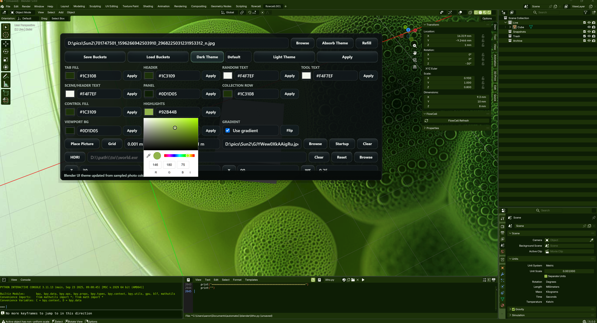

# Blender Theme Toolbox

The Blender Theme toolbox is the FlowCell window for building a Blender UI theme from a reference image, placing a viewport picture overlay, and setting the HDRI world. It is useful when you want Blender to visually match a project, brand palette, mood board, or scene reference without hand-editing every Blender theme field.

Open it from the Blender `theme` owner button in FlowCell. The toolbox stages most edits first, then sends them to Blender only when you press the matching apply button.

## Basic Flow

1. Pick a theme source with the top `Browse` button, or use `Absorb Theme` to pull the current Blender theme into the toolbox.
2. Press `Dark Theme` or `Light Theme` to generate a usable starting point from the staged colors.
3. Tune individual buckets with the eyedropper/color swatch, the hex field, or the small per-bucket apply button.
4. Press the main `Apply` button to send the visible staged theme to Blender.
5. Use `Save Buckets` and `Load Buckets` when you want to reuse a staged color setup later.
6. Use `Place Picture` when you want a reference picture in the viewport, and use the HDRI row when you want to load or rotate a world environment.

## Theme Image And Presets

| Control | How it works |
| --- | --- |
| Theme image field | Holds the image path used for sampling theme colors. You can type or paste a path here. |
| `Browse` | Picks an image, samples its colors, and stages those colors in the theme buckets. |
| `Absorb Theme` | Reads the current Blender theme and stages the visible bucket values in FlowCell. |
| `Refill` | Remixes the current staged palette into a different bucket assignment. |
| `Save Buckets` | Saves the current staged bucket values to a JSON theme file. |
| `Load Buckets` | Loads a saved bucket file back into the toolbox. |
| `Dark Theme` | Builds a dark preset from the staged palette. It does not apply to Blender until `Apply`. |
| Darkness profile menu | Chooses or saves a dark-theme brightness pattern so future dark themes keep the same balance. |
| `Light Theme` | Builds a light preset from the staged palette. It does not apply to Blender until `Apply`. |
| `Apply` | Sends the currently visible theme bucket colors to Blender. |

## Eyedroppers And Buckets

Each color bucket has three controls:

| Control | How it works |
| --- | --- |
| Color swatch / eyedropper | Opens the native color picker for that bucket. Use its eyedropper when you want to grab a color from the screen. |
| Hex field | Lets you type or paste a color such as `#86C7AC`. |
| Small apply button | Applies only that one bucket to Blender without sending the whole theme again. |

The buckets are grouped by the Blender surfaces they affect:

| Bucket | What it changes |
| --- | --- |
| `Tab Fill` | Tabs and tab-like toolbar fills. |
| `Header` | Panel headers and header strips. |
| `random text` | General UI text. |
| `tool text` | Control, button, and widget text. |
| `scene/header text` | Header labels and accent text. |
| `Panel` | Editor and panel backgrounds. |
| `Collection Row` | Outliner collection row color. |
| `Control Fill` | Buttons, fields, and widget fills. |
| `Highlights` | Active, selected, and highlighted states. |
| `Viewport BG` | Main 3D viewport background. |
| `Gradient 2` | Secondary viewport gradient color. |
| `Gradient` | Toggles the viewport gradient on or off. |
| `Flip` | Swaps `Viewport BG` and `Gradient 2`. |

Use the eyedropper when you want exact colors from an image, website, render, or screen reference. Use the hex fields when you already know the color values. Use the per-bucket apply buttons when one part of Blender needs a quick adjustment without disturbing the rest of the staged theme.

## Place Picture

Place Picture is for putting a reference image into the Blender viewport with FlowCell's overlay. The visible row is intentionally simple now: there is no separate Grid button and no near/distance/far grid fields in the toolbox.

| Control | How it works |
| --- | --- |
| `Place Picture` | Places the picture path in the Blender viewport with the overlay. |
| Picture path field | Holds the image path used by Place Picture. You can type or paste a path here. |
| `Browse` | Picks the image for Place Picture. |
| `Startup` | Saves the current Place Picture image so Blender restores it on startup. |
| `Clear` | Removes the Place Picture background and overlay while keeping the path in the field. |

Use this when you want a drawing, render, product shot, or reference board visible inside the viewport while you model or align scene elements. FlowCell handles the overlay/grid behavior internally; the user-facing workflow is just choose the picture, place it, optionally save it for startup, and clear it when done.

## HDRI World

The HDRI section stages a world image path plus rotation and strength values. Path edits and numeric edits stay in the toolbox until you press the matching button.

| Control | How it works |
| --- | --- |
| `HDRI` | Applies the HDRI path in the field. |
| HDRI path field | Holds the `.exr` or `.hdr` world file path. |
| `Clear` | Clears the current HDRI world from the Blender file. |
| `Reset` | Rebuilds a clean Blender world and reapplies the current HDRI values. |
| `Browse` | Picks an HDRI file. |
| `Z` | Applies the Z rotation field. |
| `Y` | Applies the Y rotation field. |
| `X` | Applies the X rotation field. |
| `WS` | Applies the world strength field. |

Use this when the scene needs a specific lighting environment or when the background needs to line up with the model. The rotation buttons let you nudge the world direction without replacing the HDRI.

## Notes

- The status message in the theme toolbox is a short toast; it clears itself after a few seconds.
- The theme toolbox window auto-fits to the visible toolbox content on open so the transparent area below the controls does not block clicks.
- After changing Blender bridge code or generated custom actions, resync or reload the FlowCell Blender add-on/custom actions, reopen the theme toolbox, and apply again.
